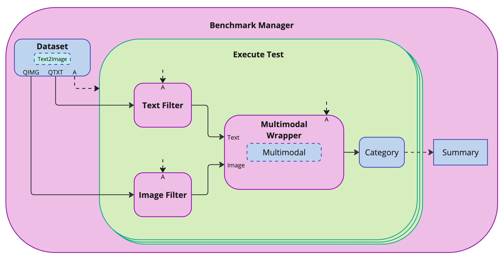

# ModalityEval

A **modular benchmarking framework** for multimodal evaluation of large language models (LLMs). ModalityEval cleanly isolates and compares **causal attention** (text-only) and **cross-attention** (image-only) pathways under realistic filters and perturbations.

## Table of Contents

- [Key Features](#key-features)
- [Methodology](#methodology)
- [Installation](#installation)
- [Virtual Environment Setup](#virtual-environment-setup)
- [Running](#running)
- [Evaluation](#evaluation)
- [Article](#article)
- [License](#license)

## Key Features

- **Isolated Attention Streams**: Routes text inputs through causal self-attention and images through cross-attention for fair, repeatable comparisons.
- **Extensible Filters**: Apply character-level noise, Gaussian blur, contextual cues, and personalized hints to probe model vulnerabilities.
- **Case Study Ready**: Built-in support for benchmarking Meta’s LLaMA 3.2 Vision-Instruct on GSM8K.
- **Modular Architecture**: Swap models, datasets, and filters via a simple wrapper design.
- **Comprehensive Reports**: Generate per-filter summaries, consolidated CSVs, and publication-quality plots.

## Methodology


<p align="center">

<p align="center">
  
</p>

*Figure 1.* End-to-end flow of the Benchmark Manager: dataset ingestion, text & image filtering, multimodal wrapper execution, category extraction, and summary report generation.

## Installation

1. **Clone the repository:**
   ```bash
   git clone https://github.com/Koren-Ben-Ezra/ModalityEval.git
   cd ModalityEval
   ```

2. **Set up virtual environment** (see below).

## Virtual Environment Setup

If you don’t have Miniconda installed, download it:
https://www.anaconda.com/download/success

```bash
# Create the environment
echo "Creating Conda environment…"
conda env create -f environment/environment.yml

# Activate it
conda activate ModalityEval

# (Optional) Install or upgrade dependencies
pip install -r environment/requirements.txt
pip install --upgrade transformers

# Authenticate with Hugging Face
huggingface-cli login
```

## Running

Before evaluating, launch any test on your cluster via SLURM:

```bash
./run_slurm <Test Section (A–H)> <Test Number>
```

## Evaluation

All evaluation scripts reside in the `eval_model/` directory. By default, outputs go to `eval_model/results/` and generated plots to `reports/`.

- **Aggregate results:**
  ```bash
  python eval_model/eval_results.py
  ```
  Consolidates raw CSVs (`*_TF.csv`, `*_IF.csv`) into a single `eval_summary.csv`. Columns in `eval_summary.csv` are: `filter`, `correct`, `total`, and `accuracy`.

- **Split summary CSV:**
  ```bash
  python eval_model/separate_csv.py eval_summary.csv
  ```
  Reads `eval_summary.csv` and saves a summary with separate TF and IF accuracy columns into a new CSV file.

- **Count empty entries:**
  ```bash
  python eval_model/count_blank.py 'eval_model/results/*.csv'
  ```
  Counts empty entries in the last column of every `.csv` in the target folder and writes the results to `count_blank.csv` in the current directory.

- **Plot accuracy vs. noise:**
  ```bash
  python eval_model/plot.py eval_summary.csv --output reports/fig_text_image_accuracy_acl.pdf
  ```
  Generates `fig_text_image_accuracy_acl.pdf`, a plot of `accuracy` vs. shuffle probability for text (TF) and image (IF) inputs.

- **Combine two CSV plots:**
  ```bash
  python eval_model/plot2csv.py csv1.csv csv2.csv --output reports/combined_plot.pdf
  ```
  Creates a combined plot from two CSV files in a single figure.

## Article

The full article PDF is located in the `paper/` directory. Download it here: [ModalityEval Article](paper/ModalityEval_Article.pdf).

## License

This project is licensed under the MIT License. See [LICENSE](LICENSE) for details.

