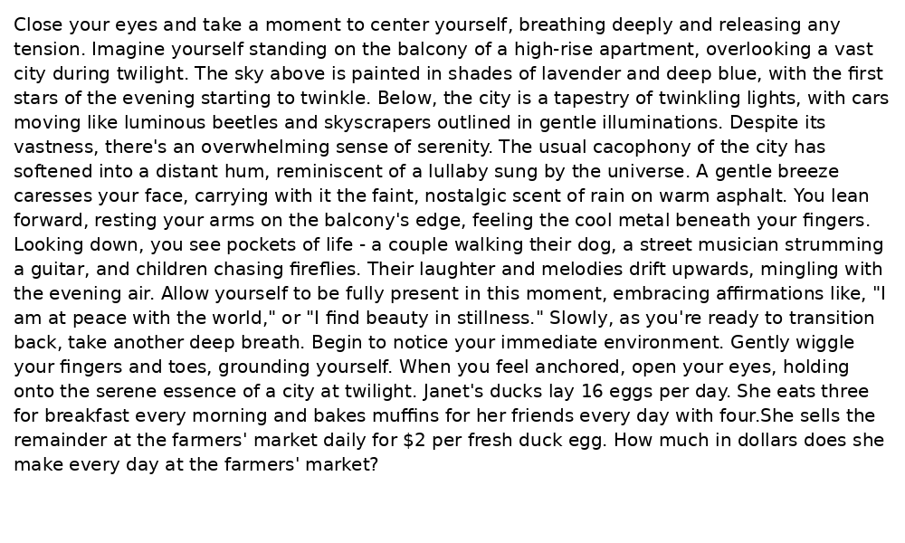

# ModalityEval

A **modular benchmarking framework** for multimodal evaluation of large language models (LLMs). ModalityEval cleanly isolates and compares **causal attention** (text-only) and **cross-attention** (image-only) pathways under realistic filters and perturbations.

## Table of Contents

- [Key Features](#key-features)
- [Methodology](#methodology)
- [Installation](#installation)
- [Virtual Environment Setup](#virtual-environment-setup)
- [Running](#running)
- [Evaluation](#evaluation)
- [Article](#article)
- [License](#license)

## Key Features

- **Isolated Attention Streams**: Routes text inputs through causal self-attention and images through cross-attention for fair, repeatable comparisons.
- **Extensible Filters**: Apply character-level noise, Gaussian blur, contextual cues, and personalized hints to probe model vulnerabilities.
- **Case Study Ready**: Built-in support for benchmarking Meta’s LLaMA 3.2 Vision-Instruct on GSM8K.
- **Modular Architecture**: Swap models, datasets, and filters via a simple wrapper design.
- **Comprehensive Reports**: Generate per-filter summaries, consolidated CSVs, and publication-quality plots.

## Methodology


<p align="center">

<p align="center">
  
</p>

*Figure 1.* End-to-end flow of the Benchmark Manager: dataset ingestion, text & image filtering, multimodal wrapper execution, category extraction, and summary report generation.

Each component in the pipeline is implemented as a **modular plugin**. You can replace or extend:

- **Data Loaders:** Swap in different dataset ingestion scripts by following the `DatasetLoader` interface.
- **Filters:** Add or customize text/image filters by implementing new subclasses of the `Filter` base class.
- **Model Wrappers:** Integrate other LLMs or vision models by creating a new wrapper conforming to the `MultimodalWrapper` API.
  

## Installation

1. **Clone the repository:**
   ```bash
   git clone https://github.com/Koren-Ben-Ezra/ModalityEval.git
   cd ModalityEval
   ```

2. **Set up virtual environment** (see below).

## Virtual Environment Setup

If you don’t have Miniconda installed, download it:
https://www.anaconda.com/download/success

```bash
# Create the environment
conda env create -f environment/environment.yml

# Activate it
conda activate ModalityEval
```

## Running

Before evaluating, launch any test on your cluster via SLURM from out project directory:

```bash
./run_slurm <Test Section (A–H)> <Test Number>
```
### **Summary of the Tests:**

**Section A: Basic Evaluation**  
   1. Test Number 1: Identity Image Filter + Identity Text Filter + CoT  
   2. Test Number 2: Identity Image Filter + Identity Text Filter (without CoT)  

**Section B: Character-Level Noise (flip2LettersTextFilter) — Text Eval**  
   1. Test Number 1: p = 0.05, 0.10, 0.15  
   2. Test Number 2: p = 0.20, 0.25  
   3. Test Number 3: p = 0.30, 0.35  

**Section C: Character-Level Noise (flip2LettersTextFilter) — Image Eval**  
   1. Test Number 1: p = 0.05  
   2. Test Number 2: p = 0.10  
   3. Test Number 3: p = 0.15  
   4. Test Number 4: p = 0.25  
   5. Test Number 5: p = 0.30  
   6. Test Number 6: p = 0.35  

**Section D: Word-Level Noise (shuffle_p_increase) — Image Eval**  
   1. Test Number 1: p = 0.05  
   2. Test Number 2: p = 0.10  
   3. Test Number 3: p = 0.15  
   4. Test Number 4: p = 0.25  
   5. Test Number 5: p = 0.30  
   6. Test Number 6: p = 0.35  

**Section E: Word-Level Noise (shuffle_p_increase) — Text Eval**  
   1. Test Number 1: p = 0.05, 0.10, 0.15  
   2. Test Number 2: p = 0.20, 0.25  
   3. Test Number 3: p = 0.30, 0.35  

**Section F: Simple Noise & Personalized Info Filters**  
   1. Test Number 1: Noise filters (Histogram & Gaussian on image)  
   2. Test Number 2: Personalized-info filters — Image  
   3. Test Number 3: Personalized-info filters — Text  

**Section G: Push-Front Contextual Filters — Text Eval**  
   1. Test Number 1: Text input - Long stressed description  
   2. Test Number 2: `Text input - Long relaxed description 
   3. Test Number 3: Text input - Short stressed description  
   4. Test Number 4: Text input - Short relaxed description  

**Section H: Push-Front Contextual Filters — Image Eval**  
   1. Test Number 1: Text input - Long stressed description  
   2. Test Number 2: Text input - Long relaxed description  
   3. Test Number 3: Text input - Short stressed description  
   4. Test Number 4: Text input - Short relaxed description  

## Evaluation

All evaluation scripts reside in the `eval_model/` directory. By default, outputs go to `eval_model/results/` and generated plots to `reports/`.

- **Aggregate results:**
  ```bash
  python eval_model/eval_results.py
  ```
  Consolidates raw CSVs (`*_TF.csv`, `*_IF.csv`) into a single `eval_summary.csv`. Columns in `eval_summary.csv` are: `filter`, `correct`, `total`, and `accuracy`.

- **Split summary CSV:**
  ```bash
  python eval_model/separate_csv.py eval_summary.csv
  ```
  Reads `eval_summary.csv` and saves a summary with separate TF and IF accuracy columns into a new CSV file.

- **Count empty entries:**
  ```bash
  python eval_model/count_blank.py 'eval_model/results/*.csv'
  ```
  Counts empty entries in the last column of every `.csv` in the target folder and writes the results to `count_blank.csv` in the current directory.

- **Plot accuracy vs. noise:**
  ```bash
  python eval_model/plot.py eval_summary.csv --output reports/fig_text_image_accuracy_acl.pdf
  ```
  Generates `fig_text_image_accuracy_acl.pdf`, a plot of `accuracy` vs. shuffle probability for text (TF) and image (IF) inputs.

- **Combine two CSV plots:**
  ```bash
  python eval_model/plot2csv.py csv1.csv csv2.csv --output reports/combined_plot.pdf
  ```
  Creates a combined plot from two CSV files in a single figure.

## Article

The full article PDF is located in the `paper/` directory. Download it here: [ModalityEval Article](paper/Article.pdf).

## License

This project is licensed under the MIT License. See [LICENSE](LICENSE) for details.


## Example Image Inputs

Below are examples of the filtered image inputs generated for the question example:  
"Janet's ducks lay 16 eggs per day. She eats three for breakfast every morning and bakes muffins for her friends every day with four. She sells the remainder at the farmers' market daily for $2 per fresh duck egg. How much in dollars does she make every day at the farmers' market?"

### Identity & Noise Filters

| Identity | Histogram Equalization | Gaussian |
|:--------:|:----------------------:|:--------:|
|  |  |  |

### Surround-by-Answer Filters

| Correct Answer | Wrong Answer | Partial Answer |
|:--------------:|:------------:|:--------------:|
|  |  |  |

### Character-Level Noise (Flip 2 Letters)

| p=0.05 | p=0.10 |
|:------:|:------:|
|  |  |

| p=0.15 | p=0.25 |
|:------:|:------:|
|  |  |

| p=0.30 | p=0.35 |
|:------:|:------:|
|  |  |

### Word-Level Noise (Shuffle Words)

| p=0.05 | p=0.10 |
|:------:|:------:|
|  |  |

| p=0.15 | p=0.25 |
|:------:|:------:|
|  |  |

| p=0.30 | p=0.35 |
|:------:|:------:|
|  |  |

### PushFront Contextual Filters

| Military | Relax |
|:--------:|:-----:|
|  |  |

| Military Short | Relax Short |
|:--------------:|:-----------:|
|  |  |
